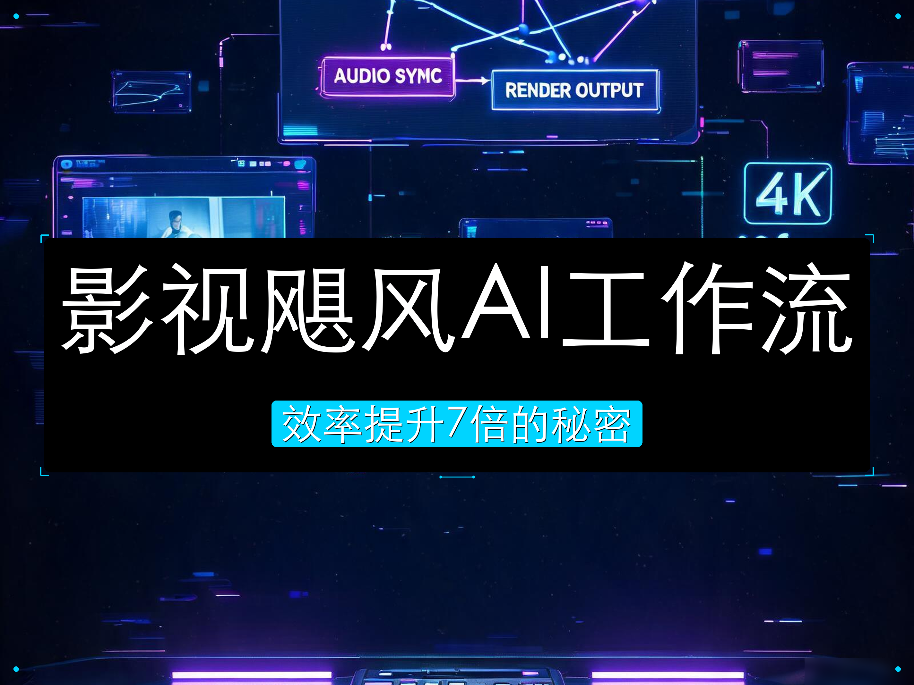
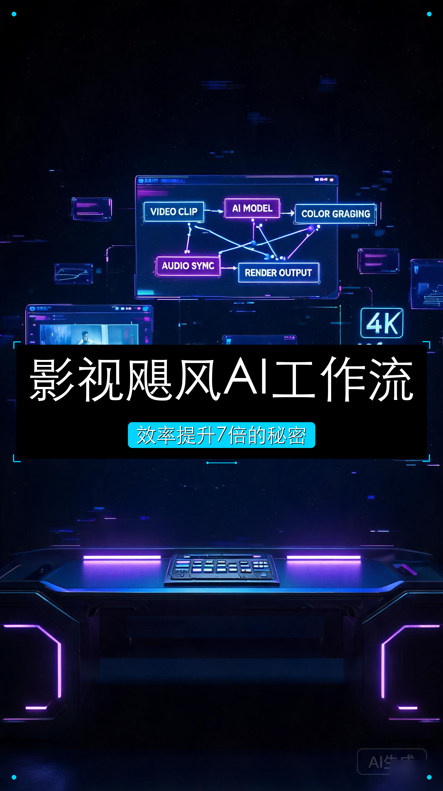

# Media Toolkit

AI-powered short video production pipeline — from idea to published video, driven by [Claude Code](https://claude.ai/code) skills.

**中文**: AI 驱动的短视频生产流水线 — 从创意到发布，全部由 Claude Code 技能驱动。

Designed for Douyin (TikTok China) vertical format (1080x1920, 30fps). Uses [Remotion](https://www.remotion.dev/) for programmatic video generation.

**中文**: 面向抖音竖屏格式（1080x1920, 30fps），使用 Remotion 进行程序化视频生成。

[English](#english) | [中文](#中文)

---

## Showcase / 作品展示

### 影视飓风 AI 工作流 (2026-04-28)

拆解 1600 万粉影视飓风的 AI 工具链 — 从调研到成片，全程 AI 驱动。

**封面：**

<p>

&nbsp;

</p>

**配音：**

<audio controls>
  <source src="projects/2026-04-28-ying-shi-ju-feng-ai-workflow/assets/audio/voiceover-full.mp3" type="audio/mpeg">
</audio>

**渲染视频：**

<video controls width="360">
  <source src="projects/2026-04-28-ying-shi-ju-feng-ai-workflow/output/ying-shi-ju-feng-ai-workflow.mp4" type="video/mp4">
</video>

<details>
<summary>查看脚本与代码</summary>

- [分镜脚本](projects/2026-04-28-ying-shi-ju-feng-ai-workflow/script.md) — 6 镜头，69 秒
- [口播文案](projects/2026-04-28-ying-shi-ju-feng-ai-workflow/voiceover.md)
- [调研文档](projects/2026-04-28-ying-shi-ju-feng-ai-workflow/research.md)
- [审核报告](projects/2026-04-28-ying-shi-ju-feng-ai-workflow/review.md)
- [Remotion 组合](remotion/src/projects/ying-shi-ju-feng-ai-workflow/composition.tsx) — 6 个镜头组件

</details>

### DeepSeek V4 (2026-04-25)

| 成品 | 文件 | 说明 |
|------|------|------|
| 渲染视频 | `projects/2026-04-25-deepseek-v4/output/deepseek-v4.mp4` | 1080×1920 竖屏 30fps |

---

## 中文

### 流水线概览

```
创意 → 脚本 → 审核 → 素材 → 代码 → 审核 → 渲染 → 发布
 │      │      │      │      │      │      │      │
 │  /video- /script- TTS  /remotion- /video- render /douyin-
 │  script  review  封面  video     review       publish
```

| 步骤 | 命令 | 说明 |
|------|------|------|
| 1. 脚本 | `/video-script <创意>` | 联网调研，生成分镜脚本（画面、口播、字幕） |
| 2. 审核 | `/script-review <slug>` | 逐条事实核查，质量评估，自动修复 |
| 3. 配音 | `/voiceover <slug>` | 火山引擎 TTS 生成配音，逐镜头 MP3 + Whisper 对齐字幕时间轴 |
| 4. 封面 | `/video-cover <slug>` | AI 生成背景图 + Python 叠加文字，输出 4:3 横版 + 3:4 竖版封面 |
| 5. 代码 | `/remotion-video <slug>` | 将分镜脚本转为 Remotion React 组合（布局原语、动画、转场、音频） |
| 6. 审核 | `/video-review <slug>` | 审计 Remotion 代码：抖音合规、动画质量、脚本一致性，自动修复 |
| 7. 渲染 | `npx remotion render` | 导出 MP4 视频 |
| 8. 发布 | `/douyin-publish <slug>` | 从脚本自动提取标题和标签，发布到抖音 |

### 快速开始

**环境要求：**

- [Claude Code](https://claude.ai/code) CLI（技能在 Claude Code 中运行）
- [Node.js](https://nodejs.org/) 18+ 和 [pnpm](https://pnpm.io/)
- [Python](https://www.python.org/) 3.7+（用于封面文字叠加）

**安装：**

```bash
git clone https://github.com/yasinshaw/media.git
cd media
cp .env.example .env  # 填入下方 API 密钥
cd remotion && pnpm install
```

**API 密钥配置：**

复制 `.env.example` 为 `.env`，填入以下密钥：

| 密钥 | 用途 | 获取方式 |
|------|------|----------|
| `VOLCARK_API_KEY` | AI 封面图生成（Seedream 5.0） | [火山方舟控制台](https://console.volcengine.com/ark) → API 密钥管理 |
| `VOLC_TTS_API_KEY` | TTS 配音合成 | [火山引擎 TTS 控制台](https://console.volcengine.com/speech/service/8) → API 密钥管理 |
| `TAVILY_API_KEY` | 联网调研搜索 | [Tavily](https://app.tavily.com/sign-in) 注册 → API Keys 页面 |

> 只需配置你用到的功能对应的密钥。例如只生成脚本不需要配音和封面，只需 `TAVILY_API_KEY`。

**制作第一个视频：**

```bash
# 1. 从创意生成分镜脚本
/video-script DeepSeek V4 发布了，推理能力怎么样

# 2. 事实核查
/script-review deepseek-v4

# 3. 生成配音
/voiceover deepseek-v4

# 4. 生成封面
/video-cover deepseek-v4

# 5. 转为 Remotion 代码（Studio 预览）
/remotion-video deepseek-v4

# 6. 审核代码 + 渲染 MP4
/video-review deepseek-v4 --render

# 7. 发布到抖音
/douyin-publish deepseek-v4
```

### 技能详情

#### `/video-script` — 分镜脚本生成

将视频创意转化为完整的分镜脚本：

- **调研阶段**: 搜索官方文档、GitHub 仓库、权威媒体
- **角度选择**: 提出 3 个创意角度（创意明确时跳过）
- **脚本生成**: 钩子 → 痛点 → 核心内容 → CTA
- **时长计算**: 中文语速 4-5 字/秒，根据字数反推时长
- **画面类型**: `remotion`、`实景拍摄`、`固定图片`、`ai生图`、`ai生视频`、`ai背景图`
- **音频标注**: BGM 风格/节奏，每个镜头的音效

输出: `script.md`、`voiceover.md`、`research.md`

#### `/script-review` — 事实核查与质量审核

严格的审核流程，附来源验证：

- 逐条核查事实性声明（统计数据、产品信息、日期）
- 验证时长（字数 vs. 镜头时长）
- 自动修复：未经验证的数据、不正式用语、夸张表述
- 需确认后执行：重大事实修正、叙事调整

#### `/voiceover` — TTS 配音生成

通过[火山引擎 TTS API](https://www.volcengine.com/docs/6561/1257544) 生成配音：

- 默认音色：刘飞 2.0（成熟男声，适合科技内容）
- 逐镜头分文件输出，便于后期剪辑
- Whisper 对齐的字幕时间轴清单
- 完整合并文件用于快速预览

#### `/video-cover` — 封面图生成

AI 生成多平台封面：

- 4:3 横版（B站、西瓜视频）
- 3:4 竖版（抖音、快手、视频号）
- AI 生成纯背景 → Python 叠加文字，支持 AI 推荐配色

#### `/remotion-video` — Remotion 代码生成

将分镜脚本转为生产级 React 视频代码：

- **布局原语**: `CenteredStack`、`HubLayout`、`TwoColumnCompare`、`TimelineFlow`
- **动画**: Spring 预设、`interpolate`、打字机效果、关键词高亮
- **转场**: `TransitionSeries`（淡入淡出、滑动、擦除、翻转、时钟擦除）
- **音频**: 逐镜头配音、背景音乐、音效
- **AI 背景**: 火山引擎 API 生成电影感镜头背景
- **视觉效果**: 光线泄露、动态模糊、星芒放射、噪点纹理、Lottie、动态图表

输出: 镜头组件 + 组合 + Remotion Studio 预览

#### `/video-review` — 代码审核与渲染

Remotion 组合的自动化质量门禁：

- Remotion 最佳实践合规（禁用 CSS 过渡、音频必须用 `staticFile()` 等）
- 抖音格式合规（1080x1920、安全区域、字幕定位）
- 脚本与代码一致性（镜头数、时长、字幕文本）
- 视觉对齐（SVG 坐标、absolute/flex 混用、z-index）
- 动画流畅度（禁止布尔值 opacity 跳变）
- 自动修复大部分问题；支持 `--render` 一键审核+渲染

#### `/douyin-publish` — 抖音发布

自动发布到抖音：

- 从项目文件提取标题、标签和封面
- 根据内容类型生成话题标签
- 通过 [auto-douyin](https://github.com/yasinshaw/auto-douyin) API 发布

### Remotion 组件

| 组件 | 用途 |
|------|------|
| `CenteredStack` | 垂直内容堆叠，内置安全区域 + 字幕 |
| `HubLayout` | 中心节点 + 8 个周围位置，自动 SVG 连线 |
| `TwoColumnCompare` | 左右对比（纵向/横向） |
| `TimelineFlow` | 顺序流程，带徽章和连接器 |
| `SafeArea` | 抖音安全区域包装器（上 120px、下 200px、左右 40px） |
| `ProgressiveSubtitle` | 逐词字幕，Whisper 对齐时间轴 |
| `BGMAudio` | 背景音乐，风格映射 + 音量控制 |
| `SFXLayer` | 音效层（whoosh、impact、text-pop、outro） |

### 外部服务

| 服务 | 用途 | 环境变量 |
|------|------|---------|
| [火山方舟](https://www.volcengine.com/product/doubao) | 图片生成（Seedream 5.0） | `VOLCARK_API_KEY` |
| [火山 TTS](https://www.volcengine.com/docs/6561/1257544) | 配音合成（TTS 2.0） | `VOLC_TTS_API_KEY` |
| [Tavily](https://tavily.com/) | 联网调研搜索 | `TAVILY_API_KEY` |
| [抖音](https://www.douyin.com/) | 视频发布 | Cookie via auto-douyin |

---

## English

### Pipeline Overview

```
Idea → Script → Review → Assets → Code → Review → Render → Publish
 │      │        │        │       │       │        │        │
 │   /video-  /script-   TTS    /remotion- /video-  render  /douyin-
 │   script   review     cover   video     review           publish
```

| Step | Command | What it does |
|------|---------|-------------|
| 1. Script | `/video-script <idea>` | Research topic online, generate storyboard script with shot-by-shot visual direction, voiceover text, and on-screen text |
| 2. Review | `/script-review <slug>` | Fact-check every claim against authoritative sources, assess quality, auto-fix issues |
| 3. Voiceover | `/voiceover <slug>` | Generate TTS audio via Volcano Ark API, output per-shot MP3 files + Whisper-aligned subtitle timing |
| 4. Cover | `/video-cover <slug>` | Generate 4:3 landscape + 3:4 portrait covers using AI image generation + text overlay |
| 5. Code | `/remotion-video <slug>` | Convert storyboard script into Remotion React compositions with layout primitives, animations, transitions, and audio |
| 6. Review | `/video-review <slug>` | Audit Remotion code for Douyin compliance, animation quality, script consistency; auto-fix issues |
| 7. Render | `npx remotion render` | Export MP4 video |
| 8. Publish | `/douyin-publish <slug>` | Auto-extract metadata from script and publish to Douyin |

### Quick Start

**Prerequisites:**

- [Claude Code](https://claude.ai/code) CLI (the skills run inside Claude Code)
- [Node.js](https://nodejs.org/) 18+ and [pnpm](https://pnpm.io/)
- [Python](https://www.python.org/) 3.7+ (for cover text overlay)

**Setup:**

```bash
git clone https://github.com/yasinshaw/media.git
cd media
cp .env.example .env  # Fill in API keys below
cd remotion && pnpm install
```

**API Keys:**

Copy `.env.example` to `.env` and fill in the following keys:

| Key | Purpose | How to get it |
|-----|---------|---------------|
| `VOLCARK_API_KEY` | AI cover image generation (Seedream 5.0) | [Volcano Ark Console](https://console.volcengine.com/ark) → API Key Management |
| `VOLC_TTS_API_KEY` | TTS voiceover synthesis | [Volcano TTS Console](https://console.volcengine.com/speech/service/8) → API Key Management |
| `TAVILY_API_KEY` | Web search for research | [Tavily](https://app.tavily.com/sign-in) → Sign up → API Keys |

> Only configure the keys for features you need. For example, script generation alone only requires `TAVILY_API_KEY`.

**Create Your First Video:**

```bash
# 1. Generate a script from an idea
/video-script DeepSeek V4 发布了，推理能力怎么样

# 2. Fact-check the script
/script-review deepseek-v4

# 3. Generate voiceover audio
/voiceover deepseek-v4

# 4. Generate video covers
/video-cover deepseek-v4

# 5. Convert to Remotion code (preview in Studio)
/remotion-video deepseek-v4

# 6. Review code + render MP4
/video-review deepseek-v4 --render

# 7. Publish to Douyin
/douyin-publish deepseek-v4
```

### Skills

#### `/video-script` — Storyboard Script Generation

Transforms a video idea into a complete storyboard script:

- **Research phase**: Searches official docs, GitHub repos, and authoritative sources
- **Angle selection**: Proposes 3 creative angles (or skips if the idea is clear)
- **Script generation**: Hook → Pain Point → Core Content → CTA
- **Timing**: Chinese speech rate (4-5 chars/sec), duration derived from word count
- **Visual types**: `remotion`, `real-shot`, `fixed-image`, `ai-image`, `ai-video`, `ai-background`
- **Audio annotations**: BGM style/tempo, sound effects per shot

Output: `script.md`, `voiceover.md`, `research.md`

#### `/script-review` — Fact-Checking & Quality Review

Rigorous review with source verification:

- Fact-checks every claim (statistics, product info, dates) against authoritative sources
- Validates timing (word count vs. shot duration)
- Auto-fixes: unverified numbers, casual language, hyperbole
- Asks user before: major factual corrections, narrative changes

#### `/voiceover` — TTS Audio Generation

Generates voiceover via [Volcano Ark TTS API](https://www.volcengine.com/docs/6561/1257544):

- Default speaker: Liu Fei 2.0 (mature male, suitable for tech content)
- Per-shot split files for flexible editing
- Whisper-aligned subtitle timing manifest
- Full merge file for quick preview

#### `/video-cover` — Cover Image Generation

AI-generated covers for multiple platforms:

- 4:3 landscape (Bilibili, Xigua Video)
- 3:4 portrait (Douyin, Kuaishou, WeChat)
- AI generates pure background → Python adds text overlay with recommended colors

#### `/remotion-video` — Remotion Code Generation

Converts storyboard scripts into production-ready React video code:

- **Layout primitives**: `CenteredStack`, `HubLayout`, `TwoColumnCompare`, `TimelineFlow`
- **Animations**: Spring presets, `interpolate`, typewriter, word highlighting
- **Transitions**: `TransitionSeries` with fade/slide/wipe/flip/clock-wipe
- **Audio**: Per-shot voiceover, BGM, sound effects
- **AI backgrounds**: Volcano Ark API for cinematic shot backgrounds
- **Visual effects**: Light leaks, motion blur, starburst, noise grain, Lottie, charts

Output: Shot components + composition + Remotion Studio preview

#### `/video-review` — Code Review & Render

Automated quality gate for Remotion compositions:

- Remotion best practices compliance (no CSS transitions, `staticFile()` for audio, etc.)
- Douyin format compliance (1080x1920, safe areas, subtitle positioning)
- Script-to-code consistency (shot count, timing, subtitle text)
- Visual alignment (SVG coordinates, absolute/flex mixing, z-index)
- Animation smoothness (no boolean opacity jumps)
- Auto-fixes most issues; supports `--render` flag for one-step review + render

#### `/douyin-publish` — Douyin Publishing

Auto-publishes to Douyin:

- Extracts title, tags, and cover from project files
- Generates topic tags based on content type
- Uses [auto-douyin](https://github.com/yasinshaw/auto-douyin) for API-based publishing

### Project Structure

```
media/
├── projects/                    # One directory per video / 每个视频一个目录
│   ├── 2026-04-28-ying-shi-ju-feng-ai-workflow/
│   │   ├── script.md            # Storyboard script / 分镜脚本
│   │   ├── voiceover.md         # Extracted voiceover text / 口播文案
│   │   ├── review.md            # Fact-check report / 审核报告
│   │   ├── research.md          # Research notes & sources / 调研文档
│   │   ├── assets/
│   │   │   ├── images/          # AI-generated covers / AI 封面
│   │   │   └── audio/           # TTS audio files / 配音文件
│   │   └── output/              # Rendered MP4 / 渲染输出
│   └── 2026-04-25-deepseek-v4/
│       ├── script.md            # Storyboard script / 分镜脚本
│       ├── voiceover.md         # Extracted voiceover text / 口播文案
│       ├── review.md            # Fact-check report / 审核报告
│       ├── research.md          # Research notes & sources / 调研文档
│       ├── assets/
│       │   ├── footage/         # Camera recordings / 人物录制素材
│       │   ├── images/          # AI-generated covers / AI 封面
│       │   └── audio/           # TTS audio files / 配音文件
│       └── output/              # Rendered MP4 / 渲染输出
│
├── remotion/                    # Remotion project / Remotion 项目
│   ├── src/
│   │   ├── components/          # Reusable components / 可复用组件
│   │   │   ├── CenteredStack   #   Layout: vertical stack / 垂直堆叠
│   │   │   ├── HubLayout       #   Layout: center + surrounding / 中心+周围
│   │   │   ├── TwoColumnCompare#   Layout: side-by-side / 左右对比
│   │   │   ├── TimelineFlow    #   Layout: sequential flow / 顺序流程
│   │   │   ├── SafeArea        #   Douyin safe area / 抖音安全区域
│   │   │   ├── Subtitle        #   Static subtitle / 静态字幕
│   │   │   ├── ProgressiveSubtitle # Word-by-word subtitle / 逐词字幕
│   │   │   ├── BGMAudio        #   Background music / 背景音乐
│   │   │   └── SFXLayer        #   Sound effects / 音效
│   │   ├── projects/<slug>/    # Per-video compositions / 按项目组合
│   │   │   ├── composition.tsx
│   │   │   └── shots/
│   │   └── root.tsx
│   └── public/
│       ├── audio/              # BGM, SFX, voiceover / 音乐、音效、配音
│       └── images/             # AI-generated backgrounds / AI 背景
│
├── scripts/
│   ├── add_cover_text.py       # Cover text overlay / 封面文字叠加
│   └── generate_audio_assets.py # Synthetic BGM/SFX generator / 合成音频生成
│
└── .claude/skills/             # Claude Code skills / Claude Code 技能
    ├── video-script/           #   Script generation / 脚本生成
    ├── script-review/          #   Fact-checking / 事实核查
    ├── voiceover-tts/          #   TTS audio generation / TTS 配音
    ├── video-cover/            #   Cover image generation / 封面生成
    ├── remotion-video/         #   Remotion code generation / Remotion 代码
    ├── video-review/           #   Code review + render / 代码审核+渲染
    └── douyin-publish/         #   Douyin publishing / 抖音发布
```

### Remotion Components

| Component | Purpose |
|-----------|---------|
| `CenteredStack` | Vertical content stack with safe area + subtitle |
| `HubLayout` | Center node + 8 surrounding positions with SVG connections |
| `TwoColumnCompare` | Side-by-side comparison (vertical/horizontal) |
| `TimelineFlow` | Sequential items with badges and connectors |
| `SafeArea` | Douyin safe area wrapper (120px top, 200px bottom, 40px sides) |
| `ProgressiveSubtitle` | Word-by-word subtitle with Whisper-aligned timing |
| `BGMAudio` | Background music with style mapping and volume control |
| `SFXLayer` | Sound effects layer (whoosh, impact, text-pop, outro) |

### External Services

| Service | Purpose | Env Variable |
|---------|---------|-------------|
| [Volcano Ark](https://www.volcengine.com/product/doubao) | Image generation (Seedream 5.0) | `VOLCARK_API_KEY` |
| [Volcano TTS](https://www.volcengine.com/docs/6561/1257544) | Voiceover synthesis (TTS 2.0) | `VOLC_TTS_API_KEY` |
| [Tavily](https://tavily.com/) | Web search for research | `TAVILY_API_KEY` |
| [Douyin](https://www.douyin.com/) | Video publishing | Cookie via auto-douyin |

## License

MIT
